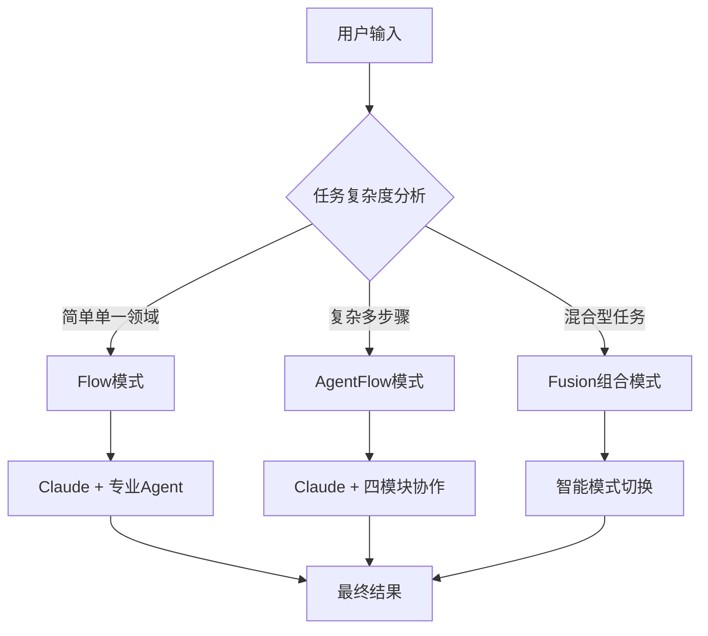

# Fusion模式

切换到🚀 **Fusion模式**，激活Claude+Flow+AgentFlow三位一体的智能协作系统。

## 模式特性
- **三位一体**: Claude核心能力 + Flow专业Agent + AgentFlow协作流程
- **智能决策**: 根据任务复杂度自动选择最适合的处理方式
- **无缝切换**: 同一会话中灵活切换处理模式
- **终极能力**: 集成所有系统的优势能力

## 切换方法
```bash
python3 ~/agentflow_switcher.py --fusion
```

## 智能协作
- **Claude核心**: 任务分析和模式选择
- **Flow模式**: 单一专业领域快速处理
- **AgentFlow模式**: 复杂任务系统化处理
- **智能切换**: 根据任务需求自动选择最佳方式

## Fusion模式工作原理

### 🧠 Claude核心协调
- **任务分析**: 智能分析任务类型和复杂度
- **模式选择**: 自动选择最合适的处理模式
- **结果整合**: 整合不同模式的结果提供最佳答案
- **质量控制**: 确保所有输出的质量和一致性

### 🎯 Flow模式集成
当任务适合单一专业领域时：
- **快速响应**: 直接调用最合适的专业Agent
- **专业深度**: 利用Agent的深度专业知识
- **效率优先**: 简单任务快速解决

### 🔗 AgentFlow集成
当任务复杂需要多步骤时：
- **系统化处理**: 使用四模块协作流程
- **全面覆盖**: 确保每个方面都得到专业处理
- **质量保证**: 内置验证和优化机制

## 智能决策流程

### 📊 任务复杂度评估


### 🎯 模式选择策略

#### Flow模式触发条件
- 单一技术领域问题
- 明确的专业知识需求
- 快速响应优先级高
- 任务边界清晰明确

#### AgentFlow模式触发条件
- 多步骤复杂任务
- 跨领域协作需求
- 质量要求极高
- 需要系统性验证

#### Fusion组合模式触发条件
- 混合型复杂任务
- 需要多种处理方式
- 灵活性和适应性要求高
- 创新性问题解决

## 使用方式

### 智能开发场景
```
用户：开发一个AI驱动的量化交易系统，包括数据采集、策略开发、实时交易
→ Fusion智能分析：
  1. Claude: 识别这是一个混合型复杂任务
  2. 分解为多个子任务
  3. 数据采集 → Flow模式调用data-engineer
  4. 策略开发 → AgentFlow模式处理复杂算法
  5. 实时交易 → Flow模式调用backend-architect
  6. Claude整合所有结果生成完整系统
```

### 创新解决方案
```
用户：创建一个结合区块链和AI的供应链管理系统
→ Fusion智能处理：
  1. Claude: 分析创新需求和技术组合
  2. 区块链部分 → Flow模式调用blockchain-developer
  3. AI分析部分 → AgentFlow模式处理复杂ML流程
  4. 系统集成 → Claude协调多模块协作
  5. 生成完整的创新解决方案
```

### 复杂问题诊断
```
用户：我的系统性能下降，请帮我全面诊断和优化
→ Fusion智能诊断：
  1. Claude: 分析问题涉及多个层面
  2. 代码层面 → Flow模式调用performance-engineer
  3. 架构层面 → AgentFlow模式系统化分析
  4. 基础设施 → Flow模式调用devops-troubleshooter
  5. Claude综合分析提供完整的诊断报告
```

## 模式优势

### 🚀 终极能力体现
- **智能性**: 自动选择最优处理方式
- **灵活性**: 一套系统应对所有场景
- **专业性**: 深度专业知识保证
- **系统性**: 复杂任务的系统化处理
- **适应性**: 动态调整处理策略

### 📈 效率提升
- **快速响应**: 简单任务立即处理
- **深度分析**: 复杂问题系统化处理
- **无缝切换**: 同一会话处理多种类型任务
- **质量保证**: 所有模式都有质量验证

## 适用场景

### 🎯 最适合Fusion模式的任务
- **企业级复杂项目**: 涉及多个技术栈和业务领域
- **创新性解决方案**: 需要跨领域知识融合
- **系统性问题解决**: 需要多角度分析和处理
- **全栈开发项目**: 前端、后端、数据库、部署全覆盖
- **AI集成项目**: 传统系统与AI能力结合

### 💡 典型应用场景
1. **数字化转型项目** - 业务+技术+数据全方位
2. **智能系统开发** - AI+传统软件+IoT集成
3. **大型重构项目** - 现有系统现代化改造
4. **云原生迁移** - 本地系统到云的完整迁移
5. **安全合规项目** - 安全+合规+技术实现

## 状态指示
- **Fusion模式激活**: 🚀 Fusion模式
- **智能决策**: Claude+Flow+AgentFlow全部就绪
- **全能状态**: 应对任何复杂任务的终极能力
- **最佳适用**: 企业级复杂项目、创新解决方案、系统性问题

现在已在🚀 **Fusion模式**下，你拥有了最强大的智能协作系统，可以应对任何复杂的开发挑战！